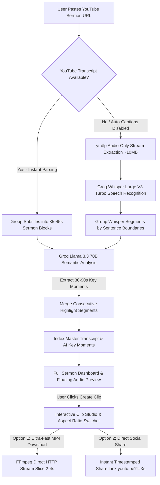

# Dabar (דָּבָר) 🎙️✨

Dabar is a premium AI-powered sermon transcription, highlight extraction, and social clip creation platform built with a **Django REST Framework** backend and a **React + Vite + TailwindCSS** frontend.

Dabar uses a **Lightweight Audio & AI Highlight Pipeline**: it ingests YouTube video transcripts or extracts audio-only streams, runs **Groq Whisper Large V3 Turbo** for high-precision speech recognition, analyzes theological themes using **Llama 3.3 70B**, and generates timestamped social clips ready for Instagram Reels, YouTube Shorts, and TikTok.

---

## How Dabar Works 🔄



---

## Key Features 🚀

- **Ultra-Fast Sermon Ingestion**: Uses YouTube auto-captions for <1s indexing, or extracts a lightweight audio stream (~10 MB) when subtitles are disabled.
- **Groq Whisper Large V3 Turbo**: High-fidelity speech recognition with accurate sentence punctuation, capitalization, and segment-level timestamps.
- **Llama 3.3 70B Key Moment Detection**: Advanced 70-billion parameter LLM identifies 30–90 second preaching moments (Core Message, Conviction Points, Gospel Calls, Illustrations).
- **Segment Highlight Merging**: Automatically combines consecutive segments belonging to the same key moment into unified cards.
- **Instant Preview Audio Player**: Listen to any transcript segment on demand via a sleek floating audio player bar.
- **FFmpeg HTTP Stream Clip Slicing**: Slices target video clips directly from YouTube streams in 2–4 seconds without downloading the full video file.
- **Timestamped Share Links**: Instantly copy or share timestamped sermon links (`https://youtu.be/ID?t=135`) to WhatsApp, X (Twitter), Facebook, and YouTube.
- **Interactive Clip Studio**: Select 9:16 vertical (Reels/Shorts), 1:1 square (Feed), or 16:9 landscape aspect ratios.

---

## Tech Stack 🛠️

### Backend
- **Framework**: Django 5.0, Django REST Framework (DRF)
- **AI/LLM**: Groq Chat Completions API (`llama-3.3-70b-versatile`)
- **Transcription**: Groq Audio API (`whisper-large-v3-turbo`)
- **Audio Extraction & Stream Slicing**: `yt-dlp`, `static-ffmpeg`
- **Subtitle Ingestion**: `youtube-transcript-api`

### Frontend
- **Framework**: React 19, React Router DOM v7
- **Bundler**: Vite 6
- **Styling**: Vanilla CSS + TailwindCSS 3.4
- **Icons**: Lucide React

---

## Getting Started ⚙️

### Prerequisites
- **Python**: 3.14+
- **Node.js**: 18+
- A **Groq API Key** (Get one at [console.groq.com](https://console.groq.com))

---

### Backend Setup

1. **Create and Activate Virtual Environment**:
   ```bash
   python -m venv venv
   # On Windows (PowerShell):
   .\venv\Scripts\Activate.ps1
   # On macOS/Linux:
   source venv/bin/activate
   ```

2. **Install Python Dependencies**:
   ```bash
   pip install -r requirements.txt
   ```

3. **Configure Environment Variables**:
   Create a `.env` file in the root directory:
   ```env
   DEBUG=True
   SECRET_KEY=your-django-secret-key
   GROQ_API_KEY=your_groq_api_key_here
   TRANSCRIPTION_BACKEND=groq
   ```

4. **Run Migrations & Start Django Server**:
   ```bash
   python manage.py migrate
   python manage.py runserver
   ```
   The backend server runs at: `http://127.0.0.1:8000`

---

### Frontend Setup

1. **Install Node Packages**:
   ```bash
   npm install
   ```

2. **Run Vite Development Server**:
   ```bash
   npm run dev
   ```
   The frontend application runs at: `http://localhost:5173`

3. **Build for Production**:
   ```bash
   npm run build
   ```

---

## Running Unit Tests 🧪

To verify Django REST endpoints and sermon processing logic:
```bash
python manage.py test
```
