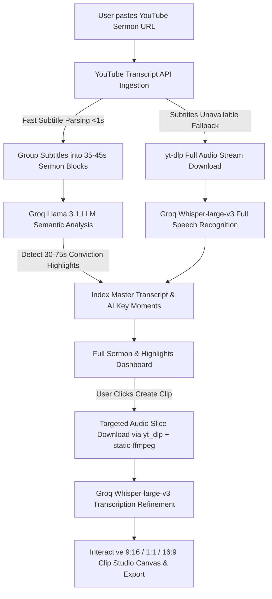

# Dabar (דָּבָר) 🎙️✨

Dabar is a premium AI-powered sermon transcription, highlight extraction, and social clip creation platform built using a **Django REST Framework** backend and a **React + Vite + TailwindCSS** frontend. 

Dabar uses a **Hybrid YouTube & Targeted Whisper Pipeline**: it instantly ingests full video transcripts via `youtube-transcript-api`, uses **Groq Llama 3.1 LLM** to analyze key conviction moments across the preaching message, and automatically formats substantial 30–60 second social clips ready for Instagram Reels, YouTube Shorts, and TikTok.

---

## How Dabar Works 🔄



---

## Features 🚀

- **Instant Full Sermon Indexing**: Ingests and indexes entire 1-hour sermon transcripts in under 1 second using YouTube subtitle data.
- **Targeted Whisper Refinement**: Runs high-fidelity Whisper (`whisper-large-v3`) transcription on targeted clip slices for accurate spelling, casing, and punctuation.
- **Llama 3.1 Moment Detection**: Groq Llama 3.1 AI identifies 30–75 second preaching moments containing complete theological thoughts, invitations, or illustrations.
- **Zero-Dependency Portable FFmpeg**: Bundles `static-ffmpeg` so audio range extraction works out of the box on Windows, macOS, and Linux without manual PATH setup.
- **Interactive Clip Studio**: Customize captions with dynamic visual themes (Gold Focus, Kinetic Bold, Minimal Dark, Clean Light) and resize output aspect ratios (9:16 vertical, 1:1 square, 16:9 landscape).
- **Full Transcript Search**: Search through the entire sermon message for specific key terms (*"faith"*, *"grace"*, *"waiting"*).

---

## Tech Stack 🛠️

### Backend
- **Core**: Django 5.0, Django REST Framework (DRF)
- **AI/LLM**: Groq Chat Completions API (`llama-3.1-8b-instant`)
- **Transcription**: Groq Audio API (`whisper-large-v3`)
- **Audio Extraction & Slicing**: `yt-dlp`, `static-ffmpeg`
- **Transcript Ingestion**: `youtube-transcript-api`

### Frontend
- **Core**: React 19, React Router DOM v7
- **Bundler**: Vite 6
- **Styling**: TailwindCSS 3.4
- **Icons**: Lucide React

---

## Getting Started ⚙️

### Prerequisites
- **Python**: 3.14+
- **Node.js**: 18+
- A **Groq API Key** (Get one at [console.groq.com](https://console.groq.com))

---

### Backend Setup

1. **Create and Activate Virtual Environment**:
   ```bash
   python -m venv venv
   # On Windows (PowerShell):
   .\venv\Scripts\Activate.ps1
   # On macOS/Linux:
   source venv/bin/activate
   ```

2. **Install Python Dependencies**:
   ```bash
   pip install -r requirements.txt
   ```

3. **Configure Environment Variables**:
   Create a `.env` file in the root directory:
   ```env
   DEBUG=True
   SECRET_KEY=your-django-secret-key
   GROQ_API_KEY=your_groq_api_key_here
   TRANSCRIPTION_BACKEND=groq
   ```

4. **Run Migrations & Start Django Server**:
   ```bash
   python manage.py migrate
   python manage.py runserver
   ```
   The backend server runs at: `http://127.0.0.1:8000`

---

### Frontend Setup

1. **Install Node Packages**:
   ```bash
   npm install
   ```

2. **Run Vite Development Server**:
   ```bash
   npm run dev
   ```
   The frontend application runs at: `http://localhost:5173`

3. **Build for Production**:
   ```bash
   npm run build
   ```

---

## Running Unit Tests 🧪

To verify the Django REST endpoints and transcription models:
```bash
python manage.py test
```
