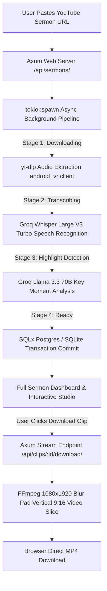

# Dabar (דָּבָר) 🎙️✨

Dabar is a high-performance, enterprise-grade AI sermon transcription, highlight extraction, and vertical video clip generator built with a **Rust (Axum + Tokio)** backend engine, a **React + Vite + TailwindCSS** web dashboard, and a **Tauri v2** desktop launcher.

---

## 🏗️ Monorepo Architecture (`apps/` & `packages/`)

Dabar is structured as an enterprise monorepo:

```text
dabar/
├── apps/
│   ├── web/                    # React Web App (Vite + Tailwind -> Deploys to Vercel)
│   │   ├── src/                # Components, pages, assets, API client
│   │   └── package.json
│   │
│   ├── server/                 # Axum REST API Server (Rust -> Deploys to Render)
│   │   ├── src/                # HTTP handlers, router & database state
│   │   └── Cargo.toml          # Imports `packages/core`
│   │
│   └── desktop/                # Desktop App Shell (Tauri v2 for Mac / Windows)
│       ├── src-tauri/          # Tauri IPC native Rust commands
│       └── tauri.conf.json     # Bundles `apps/web/dist` automatically
│
└── packages/
    └── core/                   # Shared Rust Engine
        └── src/                # downloader.rs, whisper.rs, llm.rs, ffmpeg.rs, models.rs
```

---

## How Dabar Works 🔄



---

## Key Features 🚀

- **Zero-Timeout Async Background Processing**: Non-blocking `tokio::spawn` background worker manages stage transitions (`queued` $\rightarrow$ `downloading` $\rightarrow$ `transcribing` $\rightarrow$ `detecting` $\rightarrow$ `ready`).
- **YouTube Cloud IP Bypass**: Configured with `yt-dlp` `player_client: ["android_vr", "tv"]` to bypass YouTube PO Token and SABR streaming restrictions.
- **Groq Whisper Large V3 Turbo**: High-precision speech-to-text with segment timestamps and sentence boundary alignment.
- **Groq Llama 3.3 70B Key Moment Detection**: 70-billion parameter LLM identifies 30–90 second high-impact preaching moments.
- **FFmpeg 1080x1920 Blur-Pad Canvas**: Generates vertical 9:16 short-form video clips (Shorts/Reels/TikTok) with blurred background padding.
- **Dual Database Engine**: SQLx connects to managed **PostgreSQL** on Render in production and **SQLite** locally.
- **Tauri v2 Desktop App**: Packages the React UI into a native 15MB desktop app for local offline GPU video processing.

---

## Tech Stack 🛠️

### Backend & Core Engine
- **Framework**: Rust (Axum 0.8, Tokio 1.39)
- **Database**: SQLx 0.8 (PostgreSQL / SQLite)
- **AI Models**: Groq Whisper (`whisper-large-v3-turbo`) & Groq LLM (`llama-3.3-70b-versatile`)
- **Media Engine**: `yt-dlp`, `ffmpeg`

### Frontend & Desktop
- **Web**: React 19, Vite 6, TailwindCSS 3.4, Lucide Icons
- **Desktop Shell**: Tauri v2

---

## Getting Started ⚙️

### Prerequisites
- **Rust**: 1.75+ (`rustc`, `cargo`)
- **Node.js**: 18+ (`npm`)
- **FFmpeg** & **yt-dlp** installed on PATH
- A **Groq API Key** ([console.groq.com](https://console.groq.com))

---

### Local Development Setup

1. **Configure Environment Variables**:
   Copy `.env.example` to `.env` in the root:
   ```env
   GROQ_API_KEY=your_groq_api_key_here
   DATABASE_URL=sqlite://dabar.sqlite3?mode=rwc
   PORT=8000
   CORS_ALLOWED_ORIGINS=http://localhost:5173
   ```

2. **Start the Rust Axum API Server**:
   ```bash
   cargo run --bin dabar-server
   ```
   The backend API runs at `http://localhost:8000`.

3. **Start the React Frontend Dev Server**:
   ```bash
   cd apps/web
   npm run dev
   ```
   The frontend runs at `http://localhost:5173`.

---

## Cloud Deployment 🚀

- **Backend (Render)**: Render uses native Rust deployment via `render.yaml` (`cargo build --release -p dabar-server`).
- **Frontend (Vercel)**: Point Vercel root directory to `apps/web` (`apps/web/vercel.json`).

---

## Branch Strategy 🌿

- **`main`**: Active Rust (Axum) + React + Tauri v2 monorepo.
- **`backend/django-legacy`**: Preserved legacy Django REST Framework implementation.
